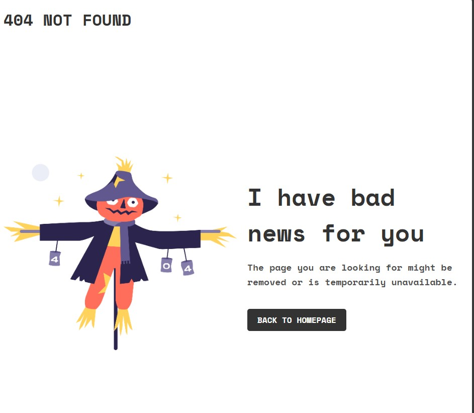
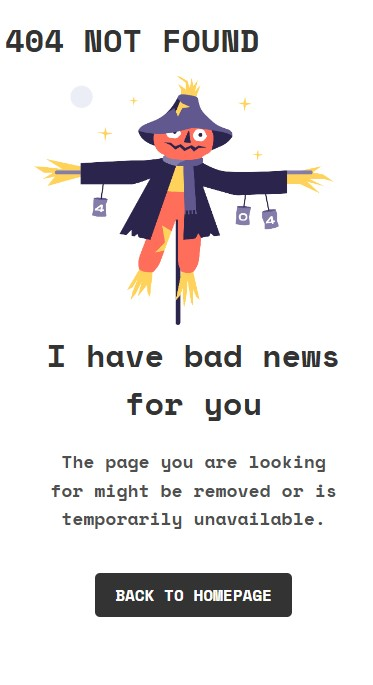

# 404 Not Found - Challenge from devChallenges.io

Este proyecto es una solución al [Desafío 404 Not Found](https://devchallenges.io/challenges/wBunSb7FPrIepJZAg0sY) en devChallenges.io. Demuestra el diseño y la funcionalidad de una página de error 404, incluyendo principios de diseño responsivo y técnicas modernas de desarrollo web.

## Table of Contents
  - [Overview](#overview)
  - [The Challenge](#the-challenge)
  - [Screenshot](#screenshot) 
  - [Links](#links)
  - [My Process](#my-process)
  - [Built With](#built-with)
  - [What I Learned](#what-i-learned)
  - [Continued Development](#continued-development)
  - [Useful Resources](#useful-resources)
  - [Author](#author)

## Overview

### The Challenge
Users should be able to:
- Ver el diseño óptimo dependiendo del tamaño de pantalla de su dispositivo (diseño responsivo).
- Comprender, a partir de lo visual y el texto, que la página es un error 404.

### Screenshot
#### Desktop Version:


#### Mobile Version:


### Links
- Solution URL: [GitHub Repository](https://github.com/Victormrl17/404_Not_Found_Page.git)


## My Process

### Built With
- Marcado HTML5 semántico
- Propiedades CSS personalizadas
- Flexbox
- Flujo de trabajo móvil primero
- [Google Fonts](https://fonts.google.com/specimen/Space+Mono) - Para la fuente Space Mono
- Media Queries para diseño responsivo

### What I Learned
En este proyecto, mejoré mis habilidades en diseño responsivo usando **Flexbox** y media queries. También practiqué el uso de fuentes personalizadas de Google Fonts y ajusté la tipografía según el tamaño de pantalla para una mejor experiencia de usuario. A continuación, un ejemplo de la configuración de Flexbox que utilicé:

```css
.container {
  display: flex;
  justify-content: space-between;
  align-items: center;
  height: 100vh;
  padding: 0 50px;
}
